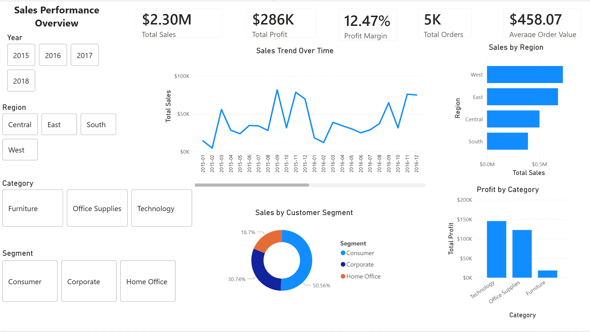
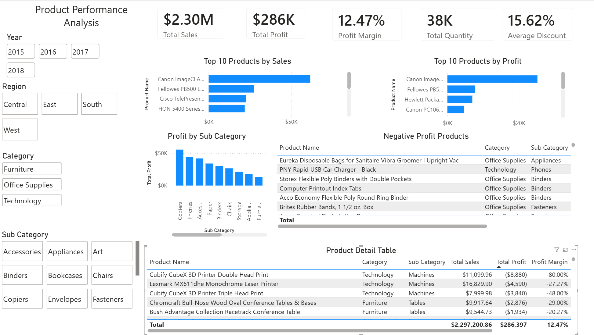
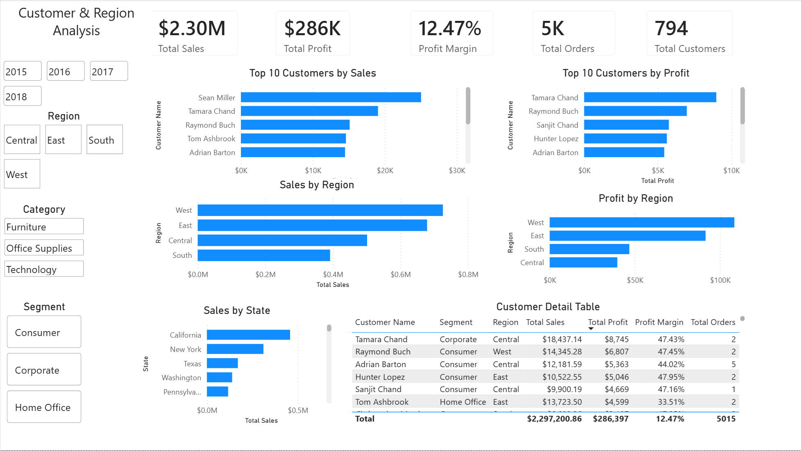
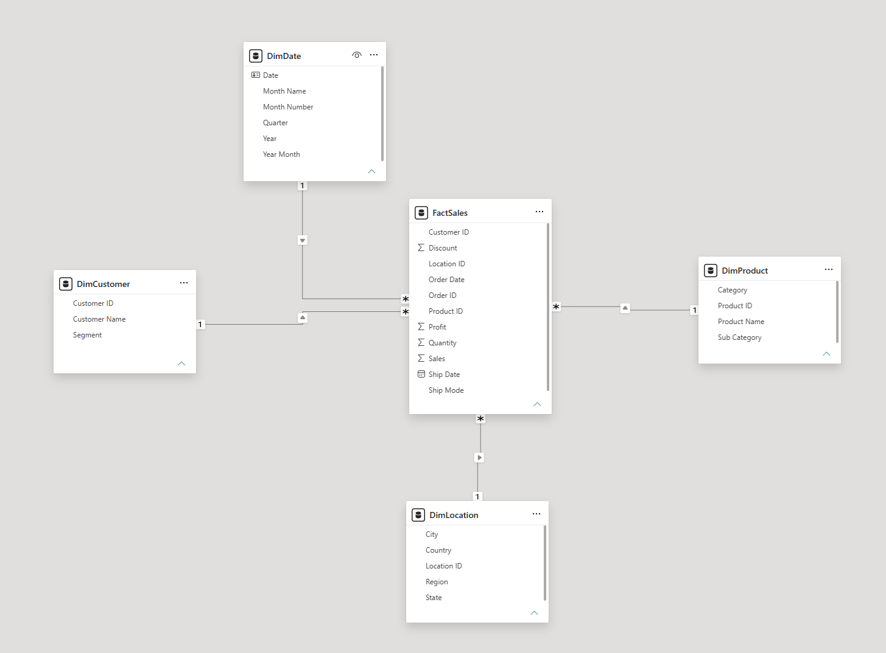

# Sales Performance Dashboard - Power BI Developer Project

## Project Overview

This project is an end-to-end Power BI dashboard built to analyze sales performance, product profitability, customer behavior and regional business performance.

The report was created using Power BI, Power Query, DAX and a star schema data model.

---

##  About Me and This Project

I am currently building a portfolio focused on Power BI, Business Intelligence and Data Analysis projects. This dashboard is part of that portfolio and was created to show practical skills that are relevant for a junior Power BI Developer or BI Analyst role.

I chose this project because sales data is a common business scenario, and it allowed me to practice important Power BI concepts such as data cleaning, data modelling, DAX measures, KPI reporting and interactive dashboard design.

Through this project, I wanted to demonstrate that I can take raw data, transform it into a clean data model, create meaningful calculations and build report pages that help users understand business performance.

This project also helped me improve my understanding of star schema modelling, Power Query transformations, DAX time intelligence and dashboard storytelling.

---

## Business Problem

The goal of this project is to help business users understand:

- overall sales and profit performance
- sales trends over time
- best-performing regions
- most profitable product categories
- top customers by sales and profit
- products with negative profit
- customer and regional performance

---

## Tools Used

- Power BI Desktop
- Power Query
- DAX
- Data Modelling
- CSV dataset

---

## Dataset

The project uses the Sample Superstore dataset, which contains sales transaction data.

The dataset includes information such as:

- orders
- customers
- products
- categories
- regions
- sales
- quantity
- discount
- profit

---

## Data Preparation

The data was cleaned and transformed in Power Query.

Main steps:

- changed data types
- fixed date columns
- converted sales, profit and discount columns to decimal numbers
- created fact and dimension tables
- removed duplicates from dimension tables
- created a custom Location ID
- disabled loading for the raw source table

---

## Data Model

The project uses a star schema data model.

Tables used:

- FactSales
- DimDate
- DimCustomer
- DimProduct
- DimLocation

Relationships:

- DimDate[Date] → FactSales[Order Date]
- DimCustomer[Customer ID] → FactSales[Customer ID]
- DimProduct[Product ID] → FactSales[Product ID]
- DimLocation[Location ID] → FactSales[Location ID]

All relationships are one-to-many with single-direction filtering.

---

## DAX Measures

The project includes the following DAX measures:

- Total Sales
- Total Profit
- Total Quantity
- Total Orders
- Total Customers
- Profit Margin
- Average Order Value
- Average Discount
- Sales Previous Year
- Sales YoY Growth
- Profit Previous Year
- Profit YoY Growth
- Profit per Order

---

## Dashboard Pages

### 1. Executive Overview

This page provides a high-level view of business performance.

It includes:

- Total Sales
- Total Profit
- Profit Margin
- Total Orders
- Average Order Value
- Sales Trend Over Time
- Sales by Region
- Profit by Category
- Sales by Customer Segment

---

### 2. Product Analysis

This page focuses on product performance and profitability.

It includes:

- Top 10 Products by Sales
- Top 10 Products by Profit
- Profit by Sub Category
- Negative Profit Products
- Product Detail Table

---

### 3. Customer & Region Analysis

This page analyzes customers and geographic performance.

It includes:

- Top 10 Customers by Sales
- Top 10 Customers by Profit
- Sales by Region
- Profit by Region
- Sales by State
- Customer Detail Table

---

## Key Insights

- Technology is the most profitable product category.
- The West region generates the highest sales.
- Some products generate negative profit despite having sales.
- Consumer is the largest customer segment by sales.
- A small number of customers contribute significantly to total sales and profit.
- Sales and profit show year-over-year growth after 2016.

---

## Skills Demonstrated

- Power Query data cleaning
- Data type conversion
- Star schema data modelling
- Fact and dimension table creation
- One-to-many relationships
- DAX measure creation
- Time intelligence with DAX
- KPI dashboard design
- Interactive slicers
- Business analysis
- Power BI report development

---

## Screenshots

### Executive Overview

### Product Analysis

### Customer & Region Analysis

### Data Model

